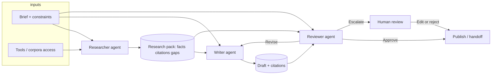

# Day 18 — Agent Workflow Design (Researcher → Writer → Reviewer)

## 1. Purpose

This document specifies a **sequential multi-agent workflow** used when a single model pass is risky or shallow: **one agent researches**, another **authors** from bounded inputs, and a third **reviews** for accuracy, completeness, and policy before publication or escalation.

Goals:

- **Separation of concerns** — Facts are gathered before persuasion/styling.
- **Traceability** — Research artifacts attach to drafts for audit.
- **Quality gate** — Reviewer rejects or revises rather than silently shipping mistakes.

Typical outcome: policy briefs, FAQ updates, investor memos, RFP appendixes, incident customer comms — anything needing **sources + prose + QA**.

---

## 2. Agents and responsibilities

### 2.1 Researcher agent

**Job:** Produce a structured **research pack** grounded in retrieved evidence, not a finished customer-facing narrative.

**Primary outputs**

- Structured **facts** with **source citations** (URL, doc ID, excerpt).
- **Gaps**: what could not be verified.
- **Conflicts**: where sources disagree, with pointers.
- **Scope note**: assumptions and date/time of retrieval.

**Typical tools**

- Search (web / internal indexer).
- Vector or keyword retrieval over manuals, policies, wikis.
- Optional: spreadsheets, ticketing read APIs for “current known issues.”

**Non-goals**

- Polished prose for end users (that is the writer’s job).

---

### 2.2 Writer agent

**Job:** Turn the research pack plus a brief into a target artifact (memo, FAQ, changelog blurb).

**Inputs (contract)**

- **Audience** and **format** (e.g., “employees, Slack post 150 words”).
- **Research pack** (required: only cite facts the researcher surfaced).
- **Style guide** snippets (tone, disclaimers).

**Outputs**

- Draft in requested structure (headings, bullets, callouts).
- **Inline citation markers** or footnote refs mapping to researcher sources.
- **Open questions** for legal/PR if the brief requires claims not supported by research.

**Guardrails**

- Must not invent numbers, dates, or promises not in the research pack unless labeled **“Proposal — verify.”**

---

### 2.3 Reviewer agent

**Job:** Evaluate the draft against the research pack and the brief — act as QA and policy filter.

**Checks**

1. **Grounding** — Every strong claim traced to evidence or flagged.
2. **Completeness** — Brief’s required sections and success criteria addressed.
3. **Risk** — PII leakage, unsubstantiated superlatives, contradictory statements.
4. **Format** — Length, disclaimers, required links.

**Outcomes**

- **Approve** — Pass through with optional minor tweaks.
- **Revise** — Send specific change requests **back to writer** with constraints (preserve citations).
- **Escalate** — Human required (legal/medical/regulated wording, major conflict in sources).

---

## 3. Workflow diagram



**Sequential reading:** Brief + tools feed **Researcher** → **Research pack** feeds **Writer** (with brief) → **Draft** + **Research pack** + **brief** feed **Reviewer** → approve, loop to writer, or escalate.

---

## 4. Data contracts (handoff payloads)

Keeping JSON-shaped payloads (names illustrative) reduces ambiguity and makes logging easier.

**Research pack (Researcher → Writer & Reviewer)**

```json
{
  "query_intent": "string",
  "retrieved_at": "ISO-8601",
  "facts": [
    { "statement": "string", "sources": [{ "id": "s1", "title": "string", "uri": "string", "excerpt": "string" }] }
  ],
  "gaps": ["string"],
  "conflicts": [{ "topic": "string", "note": "string", "sources": ["s1", "s2"] }]
}
```

**Draft (Writer → Reviewer)**

```json
{
  "format": "memo | faq | email",
  "body_markdown": "string",
  "citation_map": [{ "claim_span": "string", "fact_id": "string" }],
  "open_questions": ["string"]
}
```

**Review result (Reviewer → downstream)**

```json
{
  "verdict": "approve | revise | escalate",
  "issues": [{ "severity": "low|med|high", "detail": "string" }],
  "revision_hints": ["string"]
}
```

---

## 5. Control flow and policies

| Step | Action |
|------|--------|
| 1 | Validate brief (audience, deadline, allowed topics). |
| 2 | Researcher runs with tool budget (max calls, max tokens). |
| 3 | If research pack has **blocking gaps** for must-have claims → stop or escalate before writing. |
| 4 | Writer generates draft; cap length and enforce template. |
| 5 | Reviewer runs; **max revision loops** (e.g., 2) writer ↔ reviewer to avoid thrash. |
| 6 | On **escalate** or loop exhaustion → human queue with full bundle (brief, pack, draft, review log). |

**Observability:** Log each handoff version id, model id, and hashes of inputs/outputs for debugging and compliance.

---

## 6. Failure modes and mitigations

| Failure | Mitigation |
|---------|------------|
| Researcher retrieves stale or wrong doc | Versioned corpora, “as of” timestamps, source allowlists. |
| Writer hallucinates beyond pack | Reviewer grounding check; system prompt “only use pack.” |
| Reviewer approves bad copy | Sample human audit; second reviewer model with different temperature; red-team prompts. |
| Endless revise loop | Hard cap; escalate with diff of requested changes. |
| Tool outage | Degrade: cached research only or human-only path. |

---

## 7. When this pattern fits

**Use researcher → writer → reviewer when**

- Factual accuracy matters more than speed.
- You can afford two or more model passes.
- You have retrievable sources or APIs to ground the researcher.

**Consider simpler pipelines when**

- Task is purely creative with no grounding requirement.
- Latency budget is sub-second (then precompute or cache research).

---

## 8. Summary

This design standardizes **who may use tools** (researcher), **who may only use the pack** (writer), and **who may block release** (reviewer). Clear contracts and a bounded revision loop make the workflow teachable, testable, and suitable for production guardrails.
