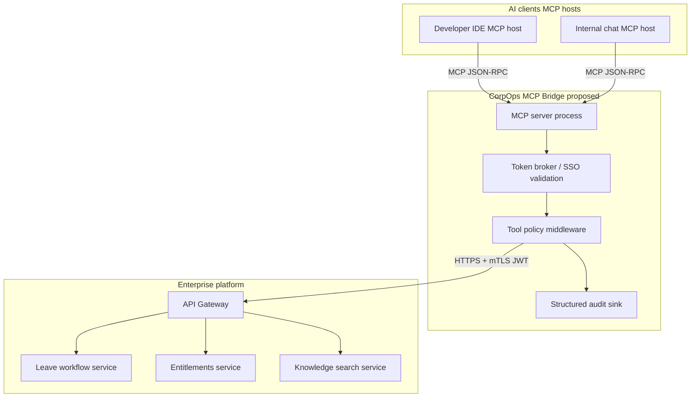

# Day 19 — MCP Server Proposal (Enterprise)

**Title:** `CorpOps MCP Bridge` — controlled Model Context Protocol surface for internal copilots.

**Goal:** Let approved AI clients (IDE plug-ins, internal chatbots) call **curated, auditable operations** without exposing raw database credentials or unbounded HTTP. MCP becomes a **policy-enforced façade** over the API defined in [`api_contract.md`](api_contract.md).

**Principles**

- **Least privilege:** Each MCP tool declares required OAuth scopes / service accounts.
- **No secret exfiltration:** Tools return structured data; attachments require separate signed URLs.
- **Correlation:** Every tool invocation logs `tool_call_id`, subject identity, and upstream `request_id`.
- **Human-in-the-loop:** Mutating tools (e.g. leave submit) can require elevated session or pre-issued approval ticket.

---

## 1. Proposed MCP surface (three enterprise tools)

The host (e.g. Claude Desktop, Cursor, internal gateway) discovers these tools via MCP `tools/list`.

### Tool 1 — `corpops.search_policy`

**Purpose:** Answer employee/manager policy questions **only** via the governed search API — never free-form scraping.

| Aspect | Specification |
|--------|----------------|
| **Maps to REST** | `POST /api/v1/knowledge/search` |
| **Risk class** | Read-only; moderate (may leak summarized policy fragments). Mitigate with role-based corpus filters enforced server-side. |

**Inputs (MCP tool parameters → JSON)**

| Parameter | Type | Required | Constraints |
|-----------|------|----------|-------------|
| `query` | string | Yes | 3–400 chars |
| `audience_role` | string | No | `EMPLOYEE` \| `MANAGER` \| `HR_BP` (default `EMPLOYEE`) |
| `doc_sources` | array of string | No | Subset of `HANDBOOK`, `FAQ`, `SECURITY`, `BENEFITS` |
| `jurisdiction` | array of string | No | e.g. `IN-KA`, `US-CA` |

**Outputs (normalized tool content block)**

Structured object:

```json
{
  "search_request_id": "uuid",
  "hits": [
    {
      "doc_ref": "string",
      "title": "string",
      "confidence": 0.0,
      "snippets": ["string"],
      "source": "HANDBOOK"
    }
  ],
  "citations_notice": "Do not cite as legal advice; confirm with HR for individual cases.",
  "degraded_modes": []
}
```

Errors map from API envelope to MCP **`isError`** with redacted internals.

---

### Tool 2 — `corpops.get_leave_entitlements`

**Purpose:** Ground copilots in **truthful balances** before suggesting dates or approving narratives.

| Aspect | Specification |
|--------|----------------|
| **Maps to REST** | `GET /api/v1/employees/{employee_id}/leave/entitlements` |
| **Risk class** | Read-only PII adjacent; JWT must attest caller may access `employee_id`. |

**Inputs**

| Parameter | Type | Required | Constraints |
|-----------|------|----------|-------------|
| `employee_id` | string | Yes | Pattern `^[A-Z0-9]{6,12}$` |
| `as_of` | string (`date`) | No | Defaults to server date |

**Outputs**

```json
{
  "employee_id": "E884211",
  "as_of": "2026-05-11",
  "currency": "DAYS_DECIMAL",
  "buckets": [
    {
      "leave_type": "ANNUAL",
      "accrued": 22.5,
      "consumed": 8.0,
      "pending_reserved": 5.0,
      "available": 9.5,
      "policy_notes": []
    }
  ],
  "calendar_flags": {
    "probation_restricted_until": null,
    "blackout_window_ids": ["Q4_EMBARGO_NA"]
  }
}
```

**Guardrail:** If JWT subject ≠ `employee_id` and lacks `hr.entitlements.read.delegated`, server returns 403; MCP surfaces `isError`.

---

### Tool 3 — `corpops.submit_leave_request`

**Purpose:** Create a **real** leave workflow ticket when the user explicitly confirms; supports idempotency for agent retries.

| Aspect | Specification |
|--------|----------------|
| **Maps to REST** | `POST /api/v1/requests/leave/submit` |
| **Risk class** | **Mutating**; requires `hr.leave.submit` + optional org policy “second factor” or manager pre-approval token in v2. |

**Inputs**

| Parameter | Type | Required | Constraints |
|-----------|------|----------|-------------|
| `employee_id` | string | Yes | Corporate ID |
| `leave_type` | string | Yes | Enum per API |
| `start_date`, `end_date` | string (`date`) | Yes | Valid range |
| `half_day_policy` | string | No | `NONE` \| `FIRST_HALF` \| `SECOND_HALF` |
| `notes_visible_to_approver` | string | No | Max 2000 chars, sanitized upstream |
| `idempotency_key` | string (`uuid`) | No | MCP host should generate for retries |

**Outputs**

Returns API **201** body:

```json
{
  "request_id": "uuid",
  "status": "PENDING_APPROVAL",
  "submitted_at": "ISO-8601",
  "consumed_calendar_days": 5,
  "approval_route": [{}],
  "policy_gate_messages": []
}
```

**Human-in-the-loop:** Proposal recommends UI confirmation string:  
“Submit leave for E884211, ANNUAL, 2026-06-02 → 2026-06-06?” before invocation from autonomous agents.

---

## 2. Architecture diagram



**Narrative**

1. **Clients** speak **MCP** (tool discovery + invocation) to **`CorpOps MCP Bridge`**.  
2. The **MCP server** validates **identity**, **tool allowlists**, and **parameter shapes**, then forwards to the **existing REST API** (`api_contract.md`).  
3. **API Gateway** enforces scopes, rate limits, and routing to microservices.  
4. **Audit** captures dual IDs: MCP `tool_call_id` ↔ HTTP `request_id` for SOC2-style traceability.

---

## 3. Deployment & operations (proposal)

| Concern | Approach |
|---------|----------|
| **Hosting** | One MCP server fleet per trust zone (`corp`, `staging`); stdin/stdout for desktop or sidecar TCP for server hosts. |
| **Credentials** | OAuth device flow or workstation cert; MCP server holds **OAuth client** + **scoped refresh**, not user API keys in prompts. |
| **Rate limiting** | Per-subject quotas on `submit_leave_request`; search capped at N/min. |
| **Versioning** | MCP `protocolVersion` negotiated; REST remains `/v1` until coordinated bump. |

---

## 4. Mapping summary

| MCP tool | REST endpoint | Verb |
|-----------|---------------|------|
| `corpops.search_policy` | `/knowledge/search` | POST |
| `corpops.get_leave_entitlements` | `/employees/{id}/leave/entitlements` | GET |
| `corpops.submit_leave_request` | `/requests/leave/submit` | POST |

---

## 5. Next steps (out of scope for Day 19 text)

1. Formal **OpenAPI 3.1** bundle linked from MCP server CI.  
2. **Synthetic tests** (`schemathesis` / Prism) against gateway mocks.  
3. **SOC2**: evidence pack tying MCP logs to REST `request_id`.

This proposal is intentionally **narrow** three-tool scope suitable for pilot review before wider MCP exposure.
