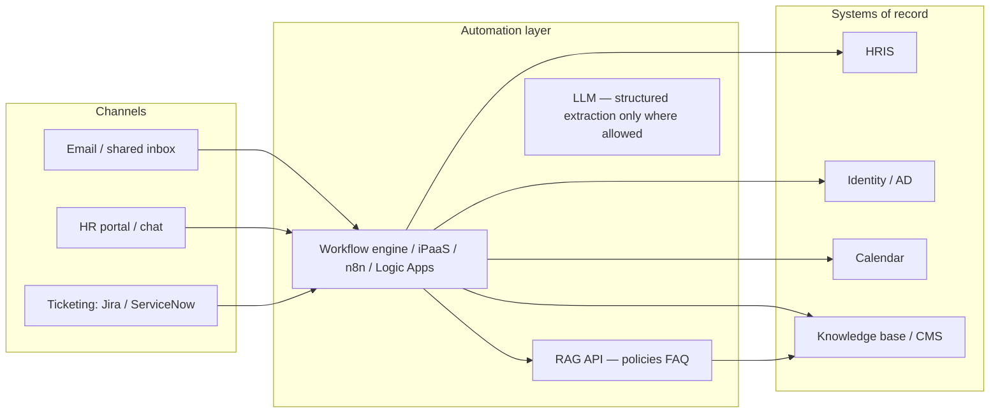

# Day 20 — Automation Blueprint: HR / Support / Operations

This blueprint describes **who is automated**, **what triggers it**, **which systems connect**, and **how risk is controlled**. It complements [`rag_cicd_pipeline.pseudo.yaml`](rag_cicd_pipeline.pseudo.yaml): CI/CD ships the RAG stack; this document ships **business process automation** around it.

---

## 1. Goals

| Stream | Objective |
|---------|-----------|
| **HR** | Reduce manual status checks; speed up repeatable answers; keep humans in the loop for decisions. |
| **Support** | Triage and deflect L1 with grounded replies; escalate with full context. |
| **Operations** | Run scheduled health checks, index freshness, and incident notifications without on-call toil. |

**Non-goals:** Fully autonomous termination, compensation changes, or legal commitments without explicit approval workflows.

---

## 2. Architecture (logical)

**Principle:** Orchestration owns **routing, SLAs, and approvals**; RAG owns **grounded text** from approved corpora; HRIS owns **authoritative numbers and statuses**.

---

## 3. HR automation scenarios

### 3.1 Employee FAQ deflection (read-only)

| Field | Detail |
|-------|--------|
| **Trigger** | Employee asks question in portal chat or HR mailbox receives “How do I…?” |
| **Flow** | 1) Classify intent (leave, benefits, payroll calendar). 2) Call **RAG** with `employee_id` for jurisdiction filter only — no salary in prompt. 3) Return answer + **citations** + link to policy doc. |
| **Systems** | Portal → RAG API → vector index + policy CMS. |
| **Guardrails** | No PII in logs; redact names in analytics; block topics outside corpus (legal, investigations) → route to HR BP. |
| **Metric** | Deflection rate, CSAT, **citation click-through**, escalation rate. |

### 3.2 Leave request **status** ping (read HRIS)

| Field | Detail |
|-------|--------|
| **Trigger** | Scheduled digest (daily) OR employee clicks “Where is my request?” |
| **Flow** | Lookup `request_id` / employee in **HRIS** → map status to plain language → optional Slack DM. |
| **Systems** | HRIS API, notification service. |
| **Guardrails** | OAuth on behalf of user or scoped service account; audit every read. |

### 3.3 Onboarding checklist (ops + HR)

| Field | Detail |
|-------|--------|
| **Trigger** | `NewHire` event from HRIS (start date T−14 days). |
| **Flow** | Create tickets: laptop, access groups, training modules; assign owners by role/location; nudge on due dates. |
| **Systems** | HRIS webhook → orchestrator → ITSM + LMS links in email. |
| **Guardrails** | Idempotent on `employee_id` + `rehire_flag`; pause if background check status ≠ cleared. |

---

## 4. Support automation scenarios

### 4.1 Ticket triage + enrichment

| Field | Detail |
|-------|--------|
| **Trigger** | New ticket created (email or portal). |
| **Flow** | 1) Extract entities (product area, error code, customer tier) via **rules + small model**. 2) Pull last 5 tickets from **CRM**. 3) Attach **RAG** snippets from internal runbooks. 4) Set priority + queue. |
| **Systems** | Ticketing API, CRM, RAG, knowledge graph (optional). |
| **Guardrails** | Never auto-close P1; PII scrubbing before LLM; escalate if sentiment < threshold. |

### 4.2 Suggested reply (human sends)

| Field | Detail |
|-------|--------|
| **Trigger** | Agent opens ticket or clicks “Suggest reply”. |
| **Flow** | RAG retrieves from **approved** KB + known-error DB → draft with citations → agent edits → send. |
| **Metric** | Time-to-first-response, edit distance (how much agents change drafts). |

### 4.3 Incident bridge (operations)

| Field | Detail |
|-------|--------|
| **Trigger** | Monitoring alert (error rate, ingestion lag) OR `SEV-2` label on ticket. |
| **Flow** | Create Slack channel, invite on-call roles, post **runbook** links (RAG or static), open bridge task, timer for status updates. |
| **Systems** | Observability → PagerDuty/Opsgenie → Slack → ITSM. |

---

## 5. Operations automation scenarios

### 5.1 RAG index freshness monitor

| Field | Detail |
|-------|--------|
| **Trigger** | Cron every 6 hours. |
| **Flow** | Compare `max(document_effective_at)` in index vs CMS “published” feed → if lag > SLA, alert + open ops ticket. |
| **Link to CI/CD** | Failed **retrieval_eval** in [`rag_cicd_pipeline.pseudo.yaml`](rag_cicd_pipeline.pseudo.yaml) blocks bad deploys; this job catches **content drift after** deploy. |

### 5.2 Cost / quota guardrail

| Field | Detail |
|-------|--------|
| **Trigger** | Hourly rollup of embedding + LLM token usage per tenant. |
| **Flow** | If usage > 80% of budget → throttle non-prod + notify owner; if > 100% → hard cap with banner in internal tools. |

### 5.3 Access review reminders (compliance ops)

| Field | Detail |
|-------|--------|
| **Trigger** | Quarterly schedule. |
| **Flow** | List privileged groups from **AD** → assign reviewers → chase non-responses → export audit pack. |

---

## 6. Cross-cutting controls

| Control | Implementation hint |
|---------|----------------------|
| **Identity** | SSO + per-integration OAuth; no long-lived user passwords in workflows. |
| **Secrets** | Vault / cloud secret manager; rotate API keys used by RAG workers. |
| **Audit** | Correlation id from channel → orchestrator → HRIS/RAG logs (retention per policy). |
| **Testing** | Staging copies of HRIS/ticketing with synthetic data; dry-run mode for “send email” steps. |
| **Kill switch** | Feature flag to disable auto-send and fall back to “draft only”. |

---

## 7. Phased rollout

| Phase | Scope | Duration (indicative) |
|-------|--------|-------------------------|
| **P0** | Read-only RAG in portal + manual send in support | 2–4 weeks |
| **P1** | Ticket triage + suggested replies (human send) | 4–8 weeks |
| **P2** | HRIS-backed status + onboarding orchestration | 8–12 weeks |
| **P3** | Incident automation + compliance cadence jobs | parallel track |

---

## 8. Deliverable checklist

- [ ] **Annotated pseudo-YAML** — [`rag_cicd_pipeline.pseudo.yaml`](rag_cicd_pipeline.pseudo.yaml) reviewed with your tech lead; map `jobs.*` to your real CI product.
- [ ] **Automation blueprint** — this document aligned to your actual tools (replace example names with Jira/ServiceNow/Workday, etc.).

No application code is required for Day 20 submission; operationalize when your org picks a workflow engine and a RAG hosting pattern.
